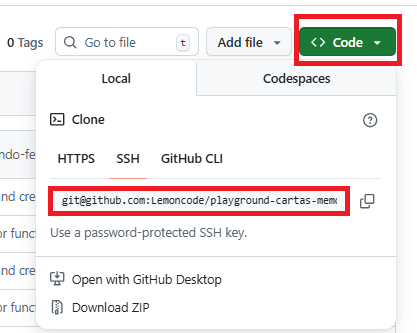
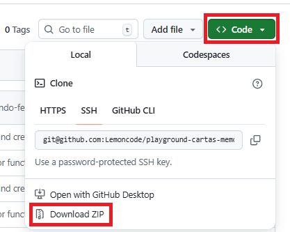
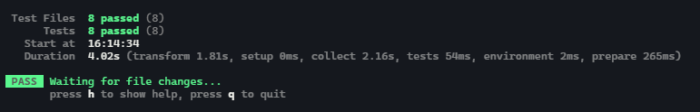

# playground cartas memo business

## ¿Cómo arrancar?

Tenemos dos maneras de poder hacerlo:

- Podemos acceder directamente a este [link](https://stackblitz.com/github/Lemoncode/playground-cartas-memo-business/tree/main) de stackblitz, el cual cargará el código del proyecto (es posible que tarde en cargar el código unos minutos)

- La segunda opción, usar el código que te proporcionamos en este repositorio:

Puedes clonarte el código a una carpeta en tu máquina:



O, si no quieres clonarte el código, también puedes descargarlo:



Una vez tengas una de las dos opciones, abre el visual studio code en la ruta en la que se encuentre tu código. Abre la consola (Terminal/New Terminal o el atajo de teclado ctrl + ñ).

Una vez tengas listo una de las dos opciones, la forma de trabajar es sencilla, implementamos los test que están divididos por ficheros dentro de la carpeta `test` y una vez tengas el test podrás ejecutar el comando `npm run test` y ver si el test pasa en verde.

> Acuérdate de eliminar la linea de por defecto que tienen todos los test: `expect(true).toBe(true);` e implementar el código real de tus tests.



## Implementando cada función.

Para cada función que debemos desarrollar en motor, hemos creado un fichero spec dentro del directorio test. Tu tarea será implementar el código de cada función en el fichero de motor y, a continuación, desarrollar los tests correspondientes.

### 1 barajarCartas

Esta función recibe como parámetro un array de cartas y devuelve un array de cartas ya barajadas. Para que sea fácil (esta función tiene algo de dificultad), te dejamos este [hilo](https://stackoverflow.com/questions/2450954/how-to-randomize-shuffle-a-javascript-array) de stackoverflow donde se ven diferentes maneras de abordar el barajado de elementos.

> **Importante** Ya hemos preparado una serie de tests para la función de barajado de cartas que te servirán como guía para implementar el resto. Puedes encontrarlos en `test/baraja-cartas.spec.ts`

### 2 sePuedeVoltearLaCarta

Aquí podremos indicar si se puede voltear o no (`true` o `false`) la carta pulsada en el html. Recuerda que cada carta tiene los flags estaVuelta y encontrada donde podremos revisar esto.

### 3 voltearLaCarta

Esta función será la encargada de modificar el objeto tablero. Lo primero será poner a true la propiedad de estaVuelta (que indica que ha sido volteada la carta que sea). Lo siguiente, será ver si el indice de la carta que hemos pulsado se tiene que guardar en el `indiceCartaVolteadaA` o `indiceCartaVolteadaB` (estas dos propiedades guardarán de manera provisional los indices para luego comprobar si son o no pareja).

¿Cómo podemos diferenciar si el indice va al A o al B? La pista está en el estado de la partida. Cuando iniciamos la partida, el estado está en `CeroCartasLevantadas`, si cuando pulso sobre la primera carta, ese es el estado, entonces el indice tiene que ir a `indiceCartaVolteadaA`, y por lo tanto el estado pasa a `UnaCartaLevantada`.

El siguiente punto es muy sencillo, si el estado cuando pulsamos sobre la segunda carta es `UnaCartaLevantada` podemos añadir el índice a `indiceCartaVolteadaB` y cambiar el estado a `DosCartasLevantadas`.

### 4 sonPareja

Esta es la más fácil de todas, saber si la idFoto de la primera y segunda carta que hemos pulsado es la misma o no.

> Pista: Puedes usar el array method [every](https://developer.mozilla.org/en-US/docs/Web/JavaScript/Reference/Global_Objects/Array/every) que comprueba si todos los elementos de un array cumplen con la condición que le indiquemos.

### 5 parejaEncontrada

Esta función se encargará de modificar de true a false la propiedad de
encontrada. Acuérdate de que para poder encontrar la siguiente pareja,
las propiedades de `estaVuelta`, el estado de la partida y los índices A
y B tienen que estar de nuevo como al principio, `estaVuelta` a false,
los índices A y B a undefined y el estado a `CeroCartasLevantadas`.

### 6 parejaNoEncontrada

Lo mismo que la anterior, pero con la diferencia de que en vez de
modificar `encontrada`, ahora será volver a false la propiedad de `estaVuelta`.

### 7 esPartidaCompleta

Si todos los elementos cumplen con la condición de que la propiedad `encontrada` está a true, la partida está completa, en caso contrario false.

> Pista: Puedes hacerlo muy fácil con el array method [every](https://developer.mozilla.org/en-US/docs/Web/JavaScript/Reference/Global_Objects/Array/every).

### 8 iniciaPartida

Esta función se ejecutará cuando pulsemos sobre el botón de iniciar partida. Esta función tendrá varias partes:

- Barajar el array de cartas.
- Actualizar el array de cartas del tablero con las cartas barajadas del punto anterior.
- Modificar el estado de la partida a `CeroCartasLevantadas`.

## Layout

Este ejercicio podemos enfocarlo de varias maneras a nivel de layout, vamos a ver que opciones tenemos:

- Podemos dejar creados los 12 divs, añadir por cada uno un identificador y luego desde código ir accediendo a cada elemento. Este enfoque tiene un problema, y es que si queremos que el juego tenga unas dimensiones más grandes, vamos a tener que añadir tantos divs y tantos identificadores como queramos que crezca, por lo tanto nuestro html puede terminar siendo enorme.
- La otra opción sería crear los 12 divs desde código javascript para añadir de manera fácil tantos divs como queramos. La dificultad que tiene esta opción en este punto de nuestro aprendizaje, es que necesitamos crear las diferentes funciones y añadir algo de complegidad que puede ser difícil de entender ahora mismo.

Si esto fuera un proyecto real y nuestro juego saliera a producción y lo comercializáramos, la segunda opción será la más adecuada, ya que permitimos que nuestro juego crezca, sin necesidad de hacer grandes cambios en el código con la consecuente posibilidad de cometer errores en el código, perder tiempo intentando duplicar código etc.

Pero como estamos aprendiendo y es un juego que nos ayuda a ir mejorando nuestra manera de aprender a ir escribiendo código con lógica, vamos a asumir que van a ser 12 divs y no va a crecer. Por lo tanto nos podemos quedar con la primera opción.

### Iniciando el código html

Pensemos que es lo que necesitamos, un "tablero" y dentro n número de casillas que van a reprensentar cada una de las fótos de los animales con los que vamos ha hacer las parejas.

Por lo tanto, lo primero que haremos será disponer en el html de un div principal que será el que contenga las casillas del juego.

```html
  <div class="contenedor"><div>
```

Ahora podemos añadir las diferentes casillas que formarán el tablero de nuestro juego, vamos a ir pensando en pequeño para que nos sea fácil entenderlo todo.

```html
  <div class="contenedor">
    <div class="carta" data-indice-id="0">
      
    </div>
    <div class="carta" data-indice-id="1">
      
    </div>
  <div>
```

Como verás hemos añadido dos divs cada una con una clase llamada `carta`, te dejamos por aquí el css:

```css
body {
  display: grid;
  grid-template-columns: 1fr;
  grid-template-rows: 1fr;
  justify-items: center;
  background-color: #B9E9FC;
}

.contenedor {
  display: inline-grid;
  grid-template-columns: repeat(4, 1fr);
  grid-template-rows: repeat(3, 1fr);
  gap: 20px 20px;
  margin: 16px;
}

.carta {
  width: 128px;
  height: 128px;
  border-radius: 10px;
  background-color: #B0DAFF;
}

.carta:hover {
  cursor: pointer;
  box-shadow: 2px 2px 21px #E893CF;
}
```

La otra propiedad que hemos añadido es `data-indice-id` esta propiedad es una propiedad custom que nos servirá para identificar a cada elemento. Dentro de cada div hemos añadido también la imagen vacía y que tendrá el mismo identificado (`data-indice-id`).

En este punto te preguntarás, y el valor que tiene cada identificador a ¿que corresponde?. Si te acuerdas tenemos un array que está dentro del objeto de `tablero` que contiene todas las cartas del juego. Aquí tienes la pista, cada indice (posición) que corresponde a uno de los elementos del array es el valor que tiene nuestro identificador. Por ejemplo

El `data-indice-id="0"` corresponde a la carta que están en la posición 0 del array de cartas y así con todas. De esta manera podemos identificar cada div, con un elemento del array de cartas del tablero.

Ahora si quieres podemos colocar en el html los 12 divs que va a tener nuestro juego.

```html
  <div class="contenedor">
    <div class="carta" data-indice-id="0">
      
    </div>
    <div class="carta" data-indice-id="1">
      
    </div>
    <div class="carta" data-indice-id="2">
      
    </div>
    <div class="carta" data-indice-id="3">
      
    </div>
    <div class="carta" data-indice-id="4">
      
    </div>
    <div class="carta" data-indice-id="5">
      
    </div>
    <div class="carta" data-indice-id="6">
      
    </div>
    <div class="carta" data-indice-id="7">
      
    </div>
    <div class="carta" data-indice-id="8">
      
    </div>
    <div class="carta" data-indice-id="9">
      
    </div>
    <div class="carta" data-indice-id="10">
      
    </div>
    <div class="carta" data-indice-id="11">
      
    </div>
  <div>
```

## Iterar por todos los elementos

Una vez tenemos los doce elementos que van a formar nuestro juego, solo nos queda, que cada elemento al yo hacer click sobre el pueda ejecutar la lógica del juego.

Ya hemos visto que cada indice que representa a nuestros divs e imágenes corresponde a la posición del array de cartas. Lo más lógico sería, iterar sobre este array y con cada índice ir localizando nuestro elemento div y programar el evento click.

```JavaScript
const mapearDivsACartas = (indiceCarta: number): void => {
  const elementoDiv = document.querySelector(`div[data-indice-id="${indiceCarta}"]`);

  if (
    elementoDiv &&
    elementoDiv instanceof HTMLDivElement
  ) {
    elementoDiv.addEventListener("click", () => {
      console.log(`Hola soy el div ${indiceCarta}`)
    });
  }
};

const crearTablero = (): void => {
  for (let indice = 0; indice < tablero.cartas.length; indice++) {
    mapearDivsACartas(indice);
  }
};

document.addEventListener("DOMContentLoaded", () => {
  crearTablero();
});
```

¿Qué hemos hecho? Primero de todo hemos creado una función que se va a encargar de iterar con un bucle `for` sobre las cartas del tablero (`crearTablero`), por cada iteración del bucle, se ejecutará la función `mapearDivsACartas` que recive como parámetros el indice del array. Esta función se encargará de localizar el elemento del html gracias al índice. Aquí hemos usado una función distinta al típico `getElementById` pero que funciona de la misma manera, que es [querySelector](https://developer.mozilla.org/en-US/docs/Web/API/Document/querySelector), a `querySelector` le indicamos que localice un div, que tiene como propiedad el `data-indice-id` y que su valor sea el que corresponda al índice del bucle. Al pulsar en cada div, se ejecutará el console.log con el mensaje.

Para terminar, la función de `crearTablero` se ejecutará en el evento `DOMContentLoaded` del navegador.
